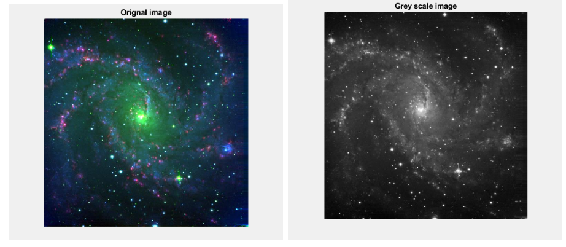
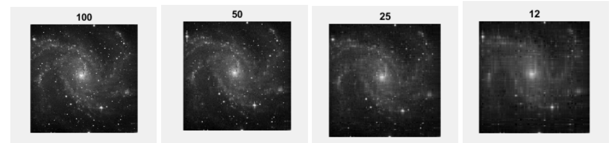

# Image-compression-with-SVD
The [script](/SVD.m) is matlab script that applies image configuration using singular value decomposition. Refer to the [report](/Report.pdf) for deatails on SVD.
This project is an assignment completed during the course Linear algebra for large scale systems.
The following figure shows the orignal image and the corresponding grey scale:

The following figure reveals the affects of choosing different number of singular components for the compressed grey scal image.

Note: Please keep the image 'NGC' in the same directory when executing in matlab
